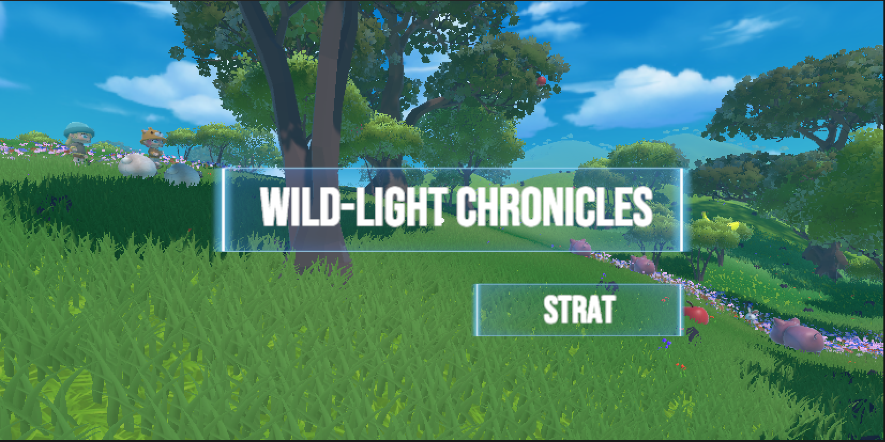
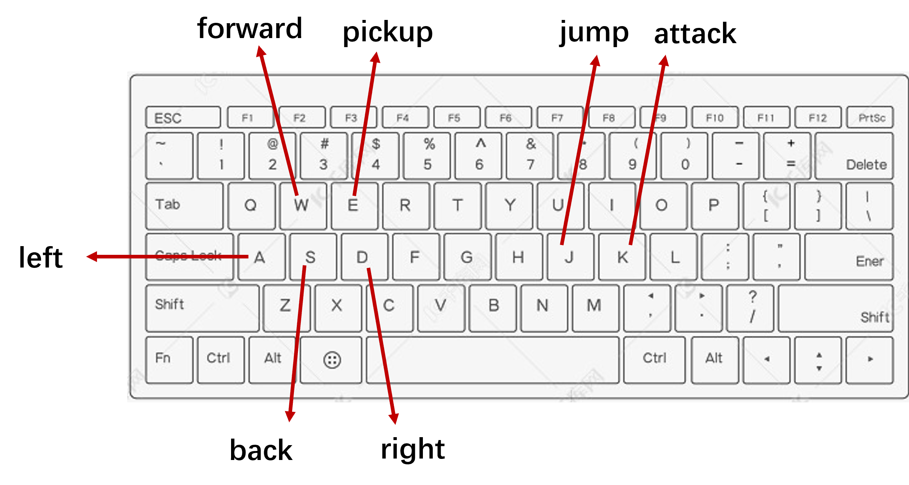
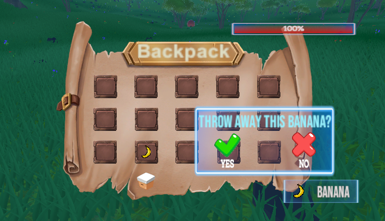
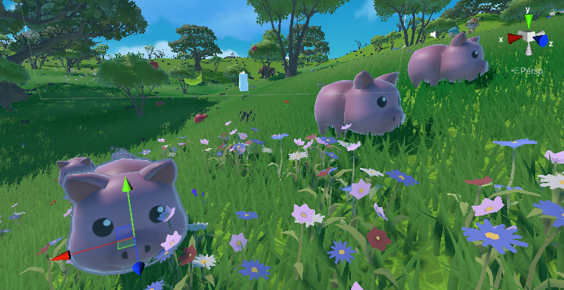
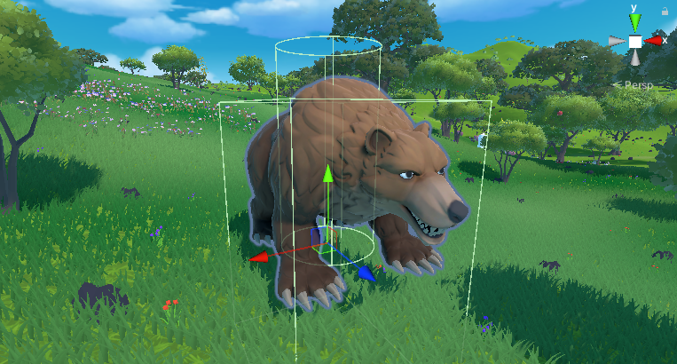

# Wild-Light Chronicles🌟
## Game Design and Implementation Report

**Explore, Survive, Conquer! "Wild-Light Chronicles" is Now Live!** 🔥

---
[Click here to access the game demo video]([https://www.google.com](https://www.bilibili.com/video/BV1T3i6YsEsd/?spm_id_from=333.999.0.0&vd_source=33334ccc1da217600235b459f5b126fe) "点击访问video")
## 1. Introduction of Game

### Game Overview

Wild-Light Chronicles is a first-person survival game filled with exploration excitement. The game employs classic WASD movement controls and mouse view manipulation, allowing players to freely roam the environment and jump over obstacles❤️. 

During exploration, players can:
- Gather various wild fruits.
- Search for weapons to enhance their capabilities.

The game features:
- A convenient inventory system, enabling players to organize and manage their collected items, using or discarding them as needed.
- A wilderness filled with diverse wildlife, including gentle sheep, vigilant wild boars, agile rabbits, and fierce bears, each with unique behavioral patterns and survival characteristics.

Encounters with wild bears test players' combat skills and reflexes, where a moment's carelessness could result in severe injury. Through meticulously designed interaction mechanics and freely explorable environments, the game allows players to write their own wilderness survival stories.

---

## 2. Resource Design and Implementation

### Resource Classes and Details

| Module | Resource Class | Details |
|---------|----------------|----------|
| Scene Resources | Terrain System | Utilized Unity Terrain system to build grassland and forest landscapes, with materials (grass, soil, rock) to shape natural terrains. |
| | Vegetation System | - **Fruit Trees and Trees Prefabs**: Fruit trees for resource gathering, decorative trees for forest atmosphere - **Decorative Vegetation**: Grass, flowers, small rocks - **Environmental Detail Textures**: High-resolution textures to enhance ground realism |
| | Skybox | Dynamic sky system simulating day-night cycles, with moving clouds and solar trajectory lighting changes |
| Character and Animal Resources | First-Person Character | Controlled using *CharacterController* for movement and jumping |
| | Animal Models and Animations | - **Sheep**: Movement and fleeing animations triggered by proximity warning zone - **Pigs and Rabbits**: Random idle and walking animations - **Bear**: Idle, walking, and attack animations; attack triggered near player |
| | Weapon Models and Effects | Basic weapon models (e.g., wooden club, axe) |
| UI Resources | Inventory UI | - **Grid System**: Implemented using Grid Layout Group for item organization - **Trash Bin Feature**: Drag and drop items to the trash bin area for disposal |
| | HUD Interface | - **Health Display**: A health bar showing player's current health - **Interaction Prompt**: Displays prompts (e.g., "Press E to pick up") |
---

## 3. Core System Implementation

### 3.1 Player Control System
The player control system is a first-person character control system based on the Unity engine. Key components include:
- **View Control**: Allows players to manipulate their field of view.
- **Character Movement**: Implements movement, jumping, gravity effects, and footstep sound effects.

  

### 3.2 Interactive System
This system enables fully functional item interaction and pickup:
- **Detection**: Calculates the real-time distance between the player and the item using `Vector3.Distance(player.position, transform.position)`.
- **Interaction**: If the player is within range, a prompt is displayed, and the item can be picked up by pressing `E`.
- **Inventory Logic**: Checks for available inventory space before adding the item and destroys the item in the scene upon pickup.

### 3.3 Backpack System

#### 3.3.1 Inventory System
Features include:
- Toggling the inventory UI.
- Adding items to inventory by finding the next empty slot and updating the item list.

#### 3.3.2 Inventory Trash Slot
Handles drag-and-drop events for item disposal:
- Uses Unity's `IDropHandler` and related interfaces.
- Displays a confirmation dialog for deletions.

---

## 3.4 Animal Interaction System

### 3.4.1 Movement in Animals
Implements random AI movement for NPCs, allowing them to wander around with predefined behaviors.

### 3.4.2 AI Sheep Avoidance
Animals respond to proximity using Unity’s `NavMeshAgent`:
- **RunAway**: Triggered at high alert levels.
- **WalkAway**: Triggered at moderate alert levels.
- **Calm State**: No movement for low alert levels.

### 3.4.3 AI Bear Tracking and Attack
A robust state machine architecture manages bear behaviors, including idle, walking, chasing, and attacking states. Unity’s `NavMeshAgent` ensures intelligent obstacle avoidance and pathfinding.

---

## 4. Characteristic Technical Points

### 4.1 Dynamic Pathfinding System in AI Animals
The dynamic pathfinding system leverages Unity's NavMesh system to enable intelligent animal movement across terrains:
- Adapts dynamically to environmental changes.
- Simulates natural and grounded movement.

### 4.2 Finite State Machine Implementation in Bear
Encapsulates bear behavior states (Idle, Walk, Chase, Attack) into separate classes using Unity's `StateMachineBehaviour`. Benefits include:
- High cohesion and low coupling.
- Easier extensibility for adding new states.

### 4.3 Dynamic Slot Management System
Uses a sophisticated approach to slot initialization and management:
- Dynamically collects child objects tagged as "Slot" at runtime.
- Optimizes performance by leveraging Unity's `CompareTag()` for efficient tag comparison.

---

## 5. Conclusion
This game centers around an open-world concept, combining rich interactive design and a dynamic ecosystem to create a gameplay experience that balances freedom and exploration. Key highlights include:
- Stunning grassland and forest environments.
- Intelligent animal behaviors.
- Meticulously crafted details ensuring player immersion and enjoyment.
